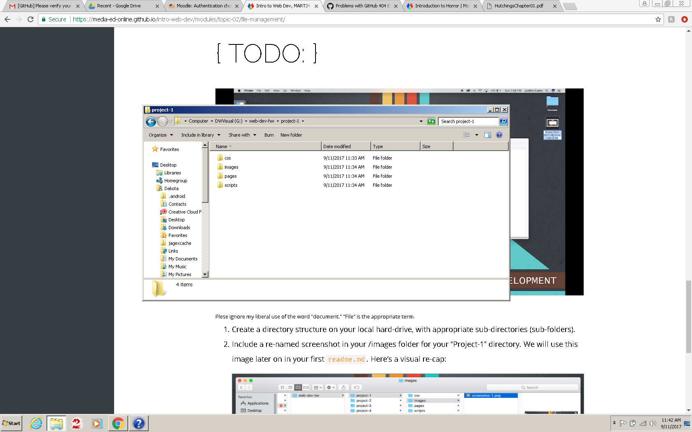

# My First README.md
## Dakota Wharry
---
So I have to admit. Week one is over and I've already learned a **ton**. But I still feel really overwhelmed. Most of these concepts I've heard, of but that was about the extent of my knowledge on them. I'm hoping things will get a little smoother as we go on, but the initial learning curve was a bit steeper than I expected.

---
I'll fully admit, I procrastinated *really bad*. I was thinking, 'Oh it's jus the first week of school, I'll be fine.' I really underestimated how much we would try to tackle right away.

As I saw a few others mention I too didn't initially realize there were two modules due this week. I just thought there would be the one so I would be able to do it pretty simply. *I was wrong*. I know I'm not the only one in this situation, but I procrastinate religiously. So with that in mind I think that I've learned my lesson. **Don't try to do in one night what they give you a week to do.**

``` Mark down really isn't all that bad, It's *essenstially* basic text with a few added elements to tell the system what to do. It feels good to have a deeper understanding of what's going on.  ```

``` <p>But HTML on the other hand </p>```

``` <p>It seems like a beast of it's own. We haven't even scratched the surface. We haven't really even looked at CSS yet either. </p>```

Even just learning about file structure was interesting to me. It's all so simple in some ways once you start to get a grasp on things. I have a much better understanding of the internet than I've ever had before. We're answering a whole list of questions I never even would have thougt to ask.



---
I feel like I'm slowly catching on, but I think one of the most daunting things at the start was trying to figure out how to navigate [Github](https://github.com/). I think I've gotten it now, but at first it was hard to see what the assignments were and where to turn them in and figure out what all was expected of me.

#### My biggest struggles were:
- Github itself
- **Procrastination**
- Understanding the class work flow
---
I think at the end of week one I can honestly say I learned a lot. More than I had anticipated for sure.I'm excited to dive back in and learn more.
### My Learning Goals
1. Understand and be comfortable with designing/maintiaining my own website.
2. How to integrate this skill into my career.
3. Gain understanding of how this tool I rely on everyday works.
